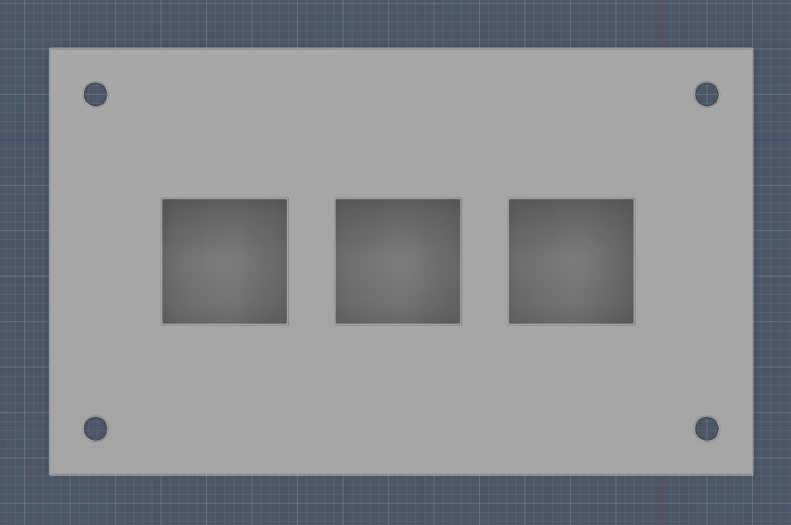
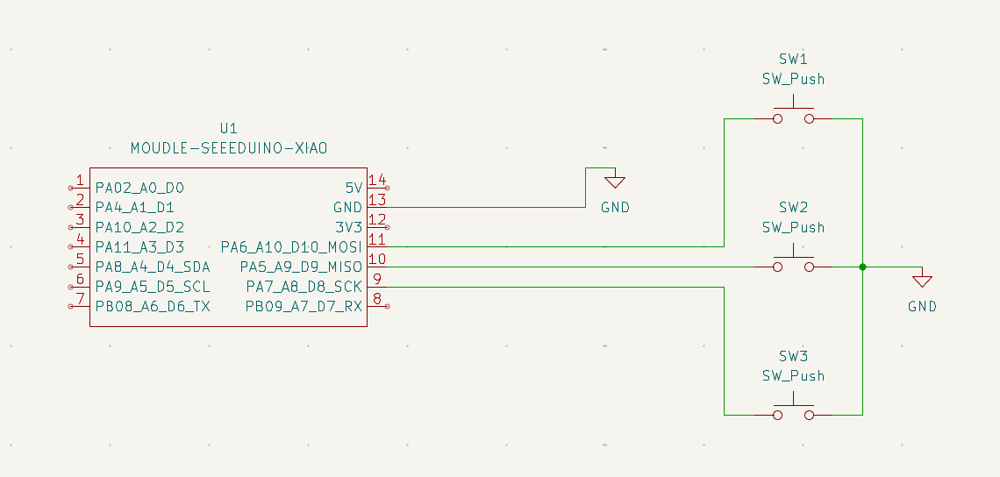
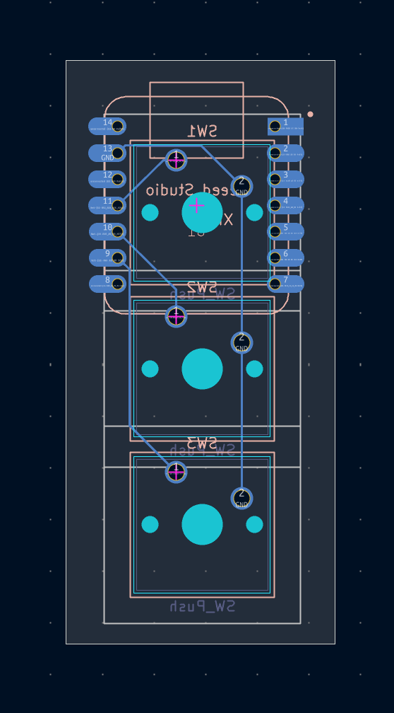
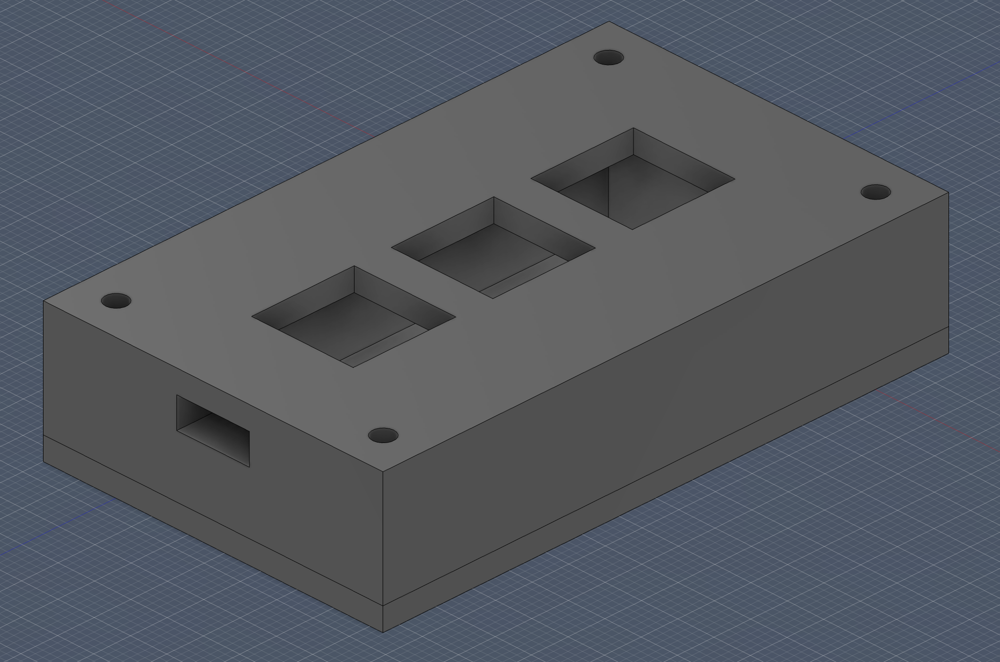

# Hackpad

## Overview

Hackpad is a custom 3-key macropad built using the Seeed XIAO RP2040.

The macropad is designed for productivity on macOS and provides quick access to common shortcuts:

- Cmd + C (Copy)
- Cmd + V (Paste)
- Cmd + Z (Undo)

The enclosure was designed in Fusion 360 and the PCB was designed in KiCad.

---

## Features

- Seeed XIAO RP2040
- 3 Mechanical Switches
- Custom PCB
- Custom 3D Printed Case
- KMK Firmware
- USB-C Connectivity

---

## CAD Model

### Complete Assembly



---

## Schematic



---

## PCB Layout



---

## Case Design



---

## Bill of Materials (BOM)

| Item | Quantity |
|------|----------|
| Seeed XIAO RP2040 | 1 |
| MX Mechanical Switches | 3 |
| Keycaps | 3 |
| Custom PCB | 1 |
| 3D Printed Case | 1 |
| USB-C Cable | 1 |

---

## Firmware

Firmware is located in:

`Firmware/main.py`

### Keymap

| Button | Action |
|---------|---------|
| 1 | Cmd + C |
| 2 | Cmd + V |
| 3 | Cmd + Z |

---

## Repository Structure

```text
Hackpad/
├── README.md
├── CAD/
├── Firmware/
├── images/
├── PCB/
└── production/
```

---

## Production Files

```text
production/
├── gerbers.zip
├── Hackpad.step
└── main.py
```

---

## Author

Antara Ganesh Rane
Created as part of the Hack Club Hackpad program.